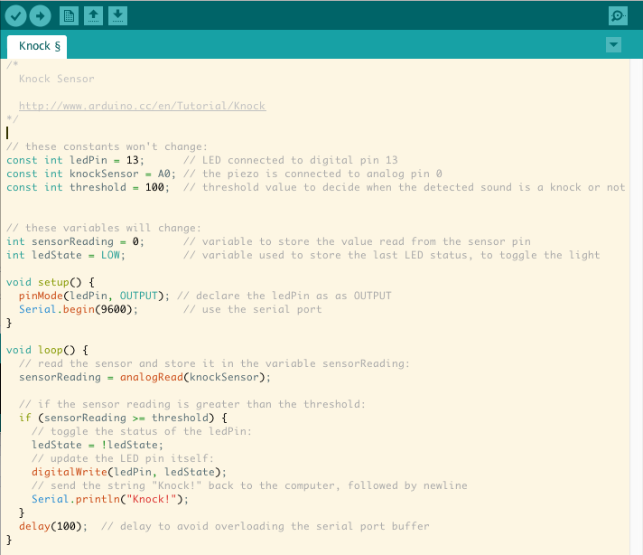
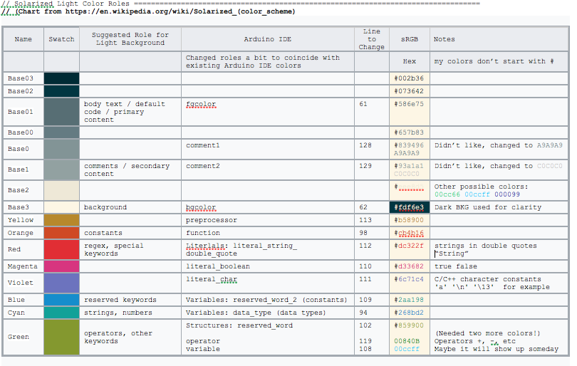

## Arduino IDE Solarized!!!  

My attempt at Solarizing the Arduino IDE  (The rtf file has all my notes.)

These are the changes to theme.txt
	
	 Original Colors 							Solarized	Notes
	 60 # foreground and background colors 
	 61 editor.fgcolor = #000000						// 586e75
	 62 editor.bgcolor = #ffffff - White 				 // fdf6e3
	
	 92 # FUNCTIONS  							
	 93 editor.keyword1.style = #d35400,bold				// xxxxxx	*keyword1 is the same as data_type (changes are meaningless)
	 94 editor.data_type.style = #d35400,bold 			// 268bd2
	 95 
	 96 # METHODS    							
	 97 editor.keyword2.style = #D35400,plain				// xxxxxx	*keyword2 is the same as function  (changes are meaningless)
	 98 editor.function.style = #d35400,plain 			// cb4b16	(Methods and Functions)
	 99 
	100 # STRUCTURES    						
	101 editor.keyword3.style = #5E6D03,plain				// xxxxxx	keyword3 is the same as function! (changes are meaningless)
	102 editor.reserved_word.style = #5E6D03,plain 			// 859900	 C/C++ control structures: if else case
	103 
	104 
	105 # TEXT - LITERALS
	106 editor.literal1.style = #00979C,plain				// xxxxxx	*literal1 same as reserved_word_2 (changes are meaningless)
	107 editor.literal2.style = #00979C,plain				// xxxxxx	literal2 is the same as function (changes are meaningless)
	108 editor.variable.style = #00979C,plain				// 00ccff	Works in testing but I never saw it do anything 
	109 editor.reserved_word_2.style = #00979C,plain 		// 2aa198	Constants
	110 editor.literal_boolean.style = #00979C,plain 		// d33682	True and False Only!
	111 editor.literal_char.style = #00979C,plain 			// 6c71c4	C/C++ character constants:   'a' '\n' '\13'  for example
	112 editor.literal_string_double_quote.style = #005C5F,plain// dc322f	"Double Quoted Strings:"
	113 editor.preprocessor.style = #5E6D03,plain			// b58900	Commands typically starting with #
	
	115 # http://www.arduino.cc/
	116 editor.url.style = #0000ff,underlined				// xxxxxx	Color for URL’s
	
	119 editor.operator.style = #434f54,plain				// 00840B	Operators
	
	122 # ?? maybe this is for words followed by a colon
	123 # like in case statements or goto
	124 editor.label.style = #7e7e7e,bold				// xxxxxx	I never saw it do anything during testing or otherwise
	
	128 editor.comment1.style = #434F54,plain				// A9A9A9
	129 editor.comment2.style = #95a5a6,plain				// C0C0C0
	
	* Denotes Fields suggested for Developers in their keywords.txt

## Further Reading:

####The Official Solarized Website:
https://ethanschoonover.com/solarized/

####Official Arduino Documentation
https://github.com/arduino/Arduino/wiki/Arduino-IDE-1.5:-Library-specification#keywords

####Helpful
http://www.eclipsecolorthemes.org/?view=theme&id=9807
https://en.wikipedia.org/wiki/Solarized_(color_scheme) (Swiped Chart from Here)

####Interesting Reading:  
A case against Syntax Highlighting: http://www.linusakesson.net/programming/syntaxhighlighting/
	
