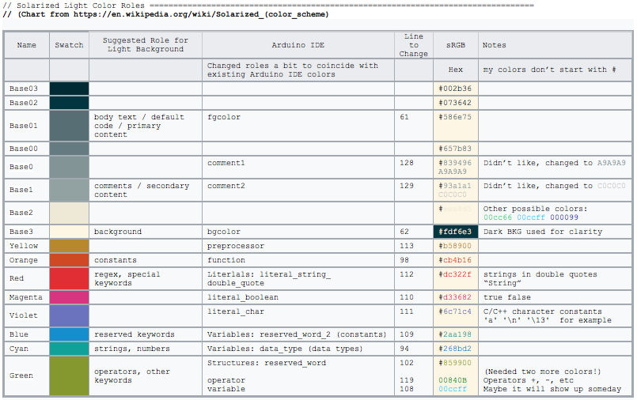

## Arduino IDE Solarized!!!  

My attempt at Solarizing the Arduino IDE  (The rtf file has all my notes including tips for the dark version)

I tried to keep this a simple as possible so it would be easy to recover from an application update.  It only involves changeing some lines in theme.txt.  It does not involve changing icons, etc.

These are the only changes to theme.txt
	
	 Original Colors 							     Solarized
	 
	 61 editor.fgcolor = #000000				     // 586e75
	 62 editor.bgcolor = #ffffff - White 			 // fdf6e3
	
	 92 # FUNCTIONS  							
	 94 editor.data_type.style = #d35400,bold 		// 268bd2

	 96 # METHODS    							
	 98 editor.function.style = #d35400,plain 		// cb4b16

	100 # STRUCTURES    						
	102 editor.reserved_word.style = #5E6D03,plain 	// 859900

	105 # TEXT - LITERALS
	109 editor.reserved_word_2.style = #00979C,plain 	// 2aa198
	110 editor.literal_boolean.style = #00979C,plain 	// d33682
	111 editor.literal_char.style = #00979C,plain 		// 6c71c4	
	112 editor.literal_string_double_quote.style = #005C5F,plain  // dc322f
	113 editor.preprocessor.style = #5E6D03,plain		// b58900
	
	119 editor.operator.style = #434f54,plain			// 00840B
	
	128 editor.comment1.style = #434F54,plain			// A9A9A9
	129 editor.comment2.style = #95a5a6,plain			// C0C0C0

## Further Reading:

#### The Official Solarized Website:
https://ethanschoonover.com/solarized/

#### Official Arduino Documentation
https://github.com/arduino/Arduino/wiki/Arduino-IDE-1.5:-Library-specification#keywords

#### Helpful
http://www.eclipsecolorthemes.org/?view=theme&id=9807

https://en.wikipedia.org/wiki/Solarized_(color_scheme) (Swiped Chart from Here)

#### Interesting Reading:  
A case against Syntax Highlighting: http://www.linusakesson.net/programming/syntaxhighlighting/
	
